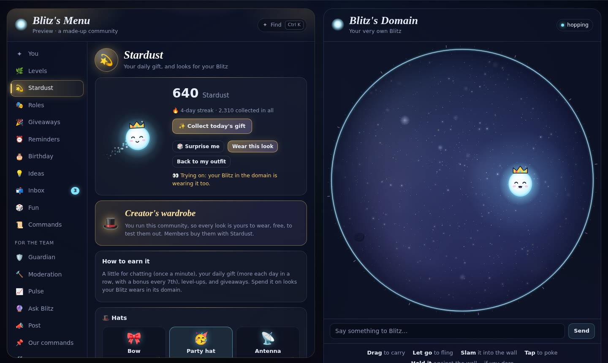
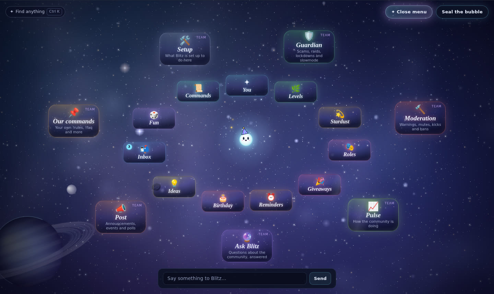
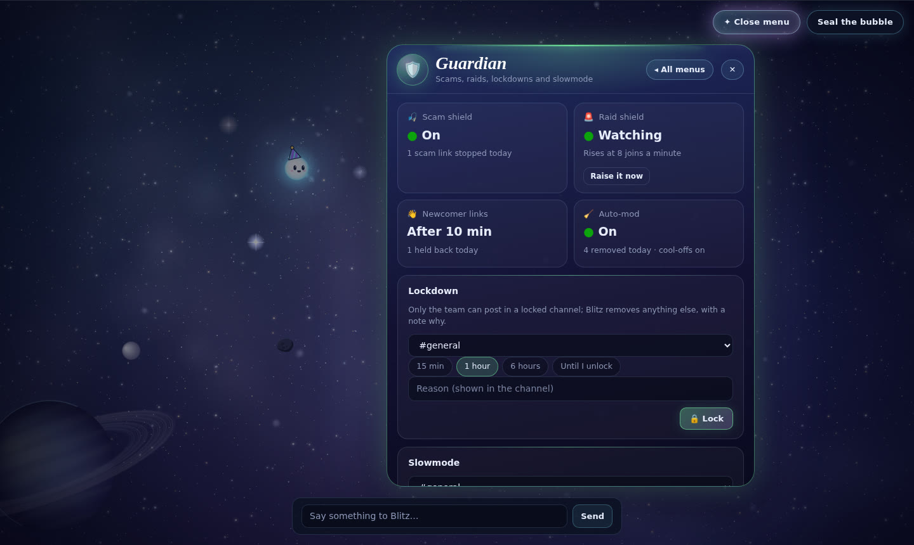

# ✨ Blitz

**Blitz** is a Root App for any community: a glowing little spirit that hangs out in your chat and does all the useful work too, free, with nothing behind a paywall. It guards the community (a scam shield, a raid shield, auto-mod, lockdowns, a warning ladder), moderates with numbered cases and members told why, runs a private inbox with the team (questions, reports and appeals), keeps levels with reward roles, a quote wall and birthdays, hosts giveaways, pays out Stardust for being around (spent on looks for your own Blitz), shows the team how the community is doing, and, with Claude as its brain, sums up reports, double-checks its filters in context, catches people up and answers the team's questions. Everything is in a menu beside its domain, where everyone can drag Blitz around, fling it into the walls and burst its bubble into space.

It doesn't come with a server template and never creates channels or roles. It fits whatever your community already has: you point it at your channels and roles on its settings page in Root, and anything you leave empty is simply off.



| | |
| --- | --- |
|  |  |

**Reviewing Blitz?** [docs/REVIEW.md](docs/REVIEW.md) has a two-minute way to see it working (no Root account needed), how it's built, the permissions it asks for and why, what it keeps, and what it sends outside Root.

## What Blitz does

| | |
| --- | --- |
| 🔮 **Its domain** | Blitz's own channel: a round, glowing bubble where it floats, zooms around and does tricks. Drag it, fling it, slam it, poke it, or pin it to the wall until the bubble shatters and opens into an endless universe full of drifting space rocks to fling it into. Everyone who opens the domain gets their own Blitz, just for them, wearing what they bought with Stardust. |
| 🧭 **Its menu** | Everything Blitz can do, without typing a single command, in a menu beside the domain: for everyone, their level and the constellation of top members, Stardust and the shop, roles, giveaways, reminders, birthdays, ideas, the inbox, toys and every command; for the team, Guardian, moderation, Pulse, Ask Blitz, posting, the community's own commands and setup. In open space Blitz summons the menu itself, as glowing cards in two orbits around it. |
| 💬 **Talk to it** | Say "blitz" in any chat (or @mention it, or reply to it) and Blitz answers: with Claude as its brain it reads the conversation, replies in its own voice, reacts with an emoji, and acts out how it feels in the domain while everyone watches. |
| 🎣 **Scam shield** | Removes account-stealing links on sight: fake Nitro and Steam gifts, lookalike sites (dlscord, steamcommunlty, disc0rd-gift), links dressed up as another site, "free gift" bait. The sender is muted for an hour and told to change their password, since their account was most likely hacked. Even a mod's hacked account is caught. |
| 🚨 **Raid shield** | When lots of people join at once (8 in a minute unless you say), newcomers can't post links or mentions and can only post every few seconds for 15 minutes, and the team is alerted. `!raid on` raises it by hand. New members also wait 10 minutes before they can post links, which keeps spam bots out. |
| 🔒 **Lockdown and slowmode** | `!lockdown #general 30m` (or `all`) lets only the team post; `!slowmode 30s` makes people wait between messages. Blitz keeps them itself, so they need no extra permissions, and they end on their own. |
| 🔨 **Moderation** | `!warn`, `!mute 30m`, `!kick`, `!ban 7d`, each saved as a numbered case, so `!history @someone` shows everything that's happened. Members get a notification saying what happened, why, and how to appeal. Mutes need no special role: Blitz removes a muted member's messages itself. Staff can only act on people ranked below them. `!unwarn` takes any case back. |
| 🪜 **Warning ladder** | Standing warnings turn into action on their own: a mute at 3 (an hour, growing with each one after), and a kick or a ban at the steps you choose. |
| 🛡️ **Auto-mod** | Removes floods, copy-paste spam, mass mentions, glitchy stacked-up text, your community's blocked words and (if you like) invite links; with stricter filters on, shouting in capitals, emoji floods and walls of text too. Three removals in ten minutes earns a 10-minute cool-off. |
| 📬 **Inbox** | Private conversations with the team, kept by Blitz (no ticket channels): members write from the menu or with `!ticket`, report someone with `!report`, or appeal a case with `!appeal 12`. The team answers from the menu (or `!reply`), closes with a note, and accepts or turns down appeals (an accepted one takes the case back). Both sides get notifications; the staff log keeps a transcript. |
| 🧠 **Blitz's brain, for the team** | With an API key and "Let Blitz's brain help moderate" ticked: every report is summed up with a severity and a suggestion (the team decides), blocked-word hits are double-checked in context so innocent messages stay ("that boss killed me" isn't a threat), `!tldr` catches anyone up on a channel, and **Ask Blitz** answers the team's questions ("who's been warned most this month?", "what happened in #general today?") by looking through Blitz's records. It never acts on its own. |
| 📈 **Pulse** | The community's vital signs for the team: a health score, messages and active people with the change from last week, joins and leaves, the busiest hours and channels, and what the team and the shields did, day by day for four weeks. |
| ✨ **Levels** | XP for chatting (once a minute, so spam doesn't count), `!rank` and `!top`, and the top ten as a constellation in the menu. **Reward roles** at any level, as many as you like, for free: `!levelrole 10 @Regular`. |
| 💫 **Stardust** | A little currency for being around: a few for chatting, a daily gift that grows with your streak (`!daily`), level-ups and giveaways. Spend it in the shop on hats, trails and glows for your own Blitz (try them on first: your Blitz in the domain wears them while you look), or `!gift` some to a friend. Admins have the **creator's wardrobe**: every look, free, to test them. |
| 🎉 **Giveaways** | `!giveaway 1d 2 winners Nitro`: members react 🎉 (or enter from the menu), winners are drawn when time's up, announced and notified. A prize like "500 stardust" pays out by itself. `!reroll` draws again. |
| 🗣️ **Quote wall** | Pick a quote wall channel, and anything that gets 🗣️ reactions (2 by default, not counting whoever said it) is saved there with a live count. `!quote` pulls a random one back up. |
| 🎂 **Birthdays** | `!birthday July 14`, then a shout-out in the birthday channel you pick and, if you pick one, a birthday role for the day. No birth year is ever asked for. |
| 👋 **Welcomes** | A welcome in the channel you pick (Blitz's own, or yours with `{user}` and `{community}`), and a role for every newcomer if you pick one. |
| 🚩 **Logs** | The staff log collects reports, moderation, shield catches, joins and leaves; the message log shows edited and deleted messages with what they said. |
| 📌 **Your own commands** | `!addcmd rules Be kind, no spam…` and anyone can type `!rules`. Great for rules, FAQs, links and how-tos. Blitz's brain knows them too. |
| ⏰ **Reminders** | `!remind 2h take the pizza out`: Blitz pings you back in the same channel. |
| 🎭 **Pick-a-role** | List roles people can give themselves (pronouns, games, ping roles); `!role gamer` toggles one. |
| 💡 **Suggestions** | `!suggest a movie night` posts the idea for 👍/👎 votes; the team answers with `!approve` or `!deny`. |
| 📊 **Polls** | `!poll 1h Movie night? \| Shrek \| Shrek 2`: reaction votes, auto-close and a results card. |
| 🎲 **Toys** | `!8ball`, `!roll`, `!flip`, `!choose`. |
| 📣 **For staff** | `!announce`, `!event`, `!say`, `!clear`, `!setxp`, `!userinfo`, and `!settings` to see how Blitz is set up. |

How Blitz compares with the best-known Discord bots, and what it took from them, is in [docs/WHY-BLITZ.md](docs/WHY-BLITZ.md).

## Setting Blitz up in a community

Install Blitz, then open its **App settings** in Root. Everything is optional:

| Setting | What it does |
| --- | --- |
| Welcome channel | Where Blitz greets new members. Empty: no welcomes. |
| Level-up channel | Where level-ups go. Empty: where they happened. |
| Quote wall | Where 🗣️-ed messages are saved. Empty: no quote wall. |
| Birthday channel | Where Blitz wishes happy birthday. Empty: no birthdays. |
| Suggestions channel | Where `!suggest` posts ideas. Empty: no suggestions. |
| Staff log | Reports, moderation, shield catches, auto-mod removals, inbox transcripts, joins and leaves. Empty: no log. |
| Message log | Edited and deleted messages, with what they said. Empty: no message log. |
| Private channels | Channels Blitz stays out of: no XP, no quotes, never shown in its domain or sent to its brain. Good for vent or staff channels. |
| Role for new members | Given to everyone who joins. |
| Birthday role | Worn for the day on someone's birthday. |
| Roles people can pick | Roles members can give themselves with `!role`. |
| Staff | Who can use staff commands. The owner, and roles that can manage the community, kick or ban, always can. |
| Welcome message | Your own welcome: `{user}`, `{name}`, `{community}` and `{members}` are filled in. Empty: Blitz's greetings. |
| Turn off levels, Stardust, the inbox, auto-mod, cool-offs | Tick them if you'd rather not have one. |
| Turn off domain links | Blitz adds a 🔮 link to its domain under its replies to commands (and spins in the domain); tick this to stop it. |
| Block invite links, Blocked words, Stricter filters | What else auto-mod removes. Words are separated by commas; `scam*` catches any ending. Stricter filters add shouting, emoji floods and walls of text. |
| Guardian | Turn off the scam or raid shield, how many joins in a minute mean a raid (8), how long newcomers wait to post links (10 minutes), the warning ladder (warnings before a mute, kick or ban: 3, off, off), and whether members are told about moderation. |
| Let Blitz's brain help moderate | With an API key: report summaries, context checks for blocked words, `!tldr` and Ask Blitz. |
| Reactions for the quote wall | How many 🗣️ a message needs. |
| Anthropic API key, About this community | Blitz's brain (see below), and a sentence or two that tells it what your community is like. |

Blitz needs permission to read and post messages, react, delete messages (for auto-mod, mutes and `!clear`), manage roles (only to hand out the roles you pick), and kick and ban (only when your staff use `!kick` or `!ban`). Type `!settings` to see what's set.

## Blitz's domain

Type `!blitz` anywhere and Blitz replies with a link into its domain. Inside:

- **Drag** to carry Blitz around. It trails after your pointer like it's on a string.
- **Let go mid-swing** to fling it. It coasts, bounces off the rim, then drifts back to the middle.
- **Slam it into the wall**, thrown or still in your hand: the rim ripples, Blitz squashes and goes `> <`. Hit it hard enough and it sees stars.
- **Tap** to poke it. Poke it a few times fast and it gets the giggles; keep going and it gets grumpy. Rest your pointer on it to pet it.
- **Talk to it** with the message box under the domain. A thought bubble shows while it thinks.
- **Hold it against the wall… if you dare.** The wall bulges, cracks spread from where Blitz is pressing, and Blitz strains and sweats. Let go and the cracks slowly heal. Keep pushing for a couple of seconds and the bubble shatters: everything slows for a heartbeat, glass flies, the window breaks away and the universe opens out from where the bubble was, filling the screen (fullscreen, where Root allows it).
- **Out in the universe** there are no walls: deep space in layers that slide past as the camera follows Blitz (nebulae, galaxies, a ringed planet, shooting stars it turns to watch). Fling Blitz and it streaks off with the stars blurring behind it, then settles wherever it lands; carry it to the edge of the screen to travel.
- **Space rocks** drift and tumble everywhere out there, lit by Blitz's glow as it passes, a few glittering with crystal. Fling Blitz into one and it bonks off with a puff of dust and chips ("BONK").
- **The menu** sits beside the domain (below it on narrow screens): pick a section on the left, and Blitz answers whatever you do there with a little speech bubble in the domain. Every section has its own colour, and rewards (your daily gift, a new look) fly out of the menu into Blitz as stardust. People only see what they're allowed to use; the team's tools have their own group.
- **Find anything** with Ctrl K (⌘K on a Mac, or `/`): type a few letters of a section or a command and press Enter to go straight there, in either menu.
- **Summon the menu** out in space with the ✦ button up top (or just type "menu"): Blitz lights up, rings out light, and the sections bloom out of it as glowing cards that hang in the dark around it, drifting like something half-remembered from a dream. Cards lean toward your pointer. Pick one and it unfolds into a floating page as Blitz streams light into it, then hovers beside it, watching; send it away and it dissolves back into Blitz in a stream of light.
- **Your own Blitz's looks**: what you buy in the shop (a crown, a wizard hat, a halo; a rainbow, ember or frost trail; a golden, rose or void glow), your Blitz wears in your domain window. Try things on in the shop first.
- **Standing guard**: while a raid shield is up, or every channel is locked, two arcs of warm light circle Blitz.
- **Seal the bubble** (up top out in space) folds the universe back in and the window gathers around it; it also re-forms on its own after two quiet minutes.
- Leave it alone and it does tricks on its own: loop-de-loops, spins, hops, zooming laps, the odd heart drawn in the air. After a while it dozes off. Any touch wakes it.

### Talking to Blitz

With an Anthropic API key in Blitz's App settings (see the [setup guide](docs/SETUP-GUIDE.md#give-blitz-its-brain-optional)), Claude is Blitz's brain. It reads your message along with the last few messages in the channel and Blitz's recent conversation there, then decides how Blitz feels, which trick it does, what it says in the domain and what it replies in chat. You can ask it things ("blitz where do i post my art?", "blitz settle this: is a hotdog a sandwich"), tease it, hype it up or vent to it. It knows the community's channels and commands, matches the vibe of the chat, and drops the bit when someone sounds genuinely not okay. Tell it about your community in the "About this community" setting and it'll fit right in.

**Without a key, Blitz still answers**, with its wits: it works out what you're asking and answers from what it already knows about the community, and nothing leaves Root. Some of what it can do on its own:

| Ask something like… | Blitz… |
| --- | --- |
| "blitz where do i post my art?", "and music?" | points at the channel whose name or topic fits ("drawings" finds #art), and keeps up with follow-ups |
| "what are the rules?", "where are your socials?", "when's movie night?" | answers with the community's own commands (`!rules`, `!socials`, `!movienight`) |
| "what level am i?", "who's at the top?", "how much stardust do i have?" | reads out your numbers and the leaderboard |
| "what roles can i get?", "how do i get the Veteran role?" | lists the roles you can pick, or the level that unlocks one |
| "remind me in 2h to take the pizza out", "my birthday is July 14", "give me the gamer role", "claim my daily" | **does it**: runs the real command for you, with the usual checks |
| "how do i make a poll?", "someone's spamming, i need a mod" | the right command, with how to use it; or how to reach the team privately |
| "what's 15% of 80?", "roll 2d6", "pizza or tacos?", "will i pass my exam?" | maths, dice, coins, picking for you, and its crystal ball |
| "tell me a joke", "a fun fact", "how are you?", "are you an AI?" | jokes, space facts, and honest answers about itself |
| "i want to die" | drops the bit: gently says it cares, and points to a crisis line and the team |

With or without a key, Blitz acts out how it feels in its domain. The moods it picks up on:

| Say something like… | Blitz… |
| --- | --- |
| "hi blitz", "hey" | lights up and comes to say hi: "hii!!" |
| "i love you blitz", "<3" | heart eyes, hearts everywhere, draws a heart in the air |
| "blitz ur so cute" | blushes and hides behind the edge of its bubble |
| "lmao", "😭" | laughs |
| "BLITZ LETS GOOO" | star eyes, zooms laps around the domain |
| "blitz i'm sad" | floats over for a hug |
| "blitz you're stupid" | puffs up, goes red and darts away: "hmph!" |
| "boo!" | gets scared |
| "gn blitz" | yawns and falls asleep |
| "blitz spin", "do a loop", "dance", "zoomies" | does the trick (unless it's sulking) |

In chat, Blitz leaves a matching emoji on your message and replies. Without a key, real answers go out right away, and a little canned line for chatter ("hii! *hops*") at most once every 25 seconds per channel. In the domain, type to your Blitz: your message flies over to it, a thought bubble shows while it thinks, then it answers in a speech bubble.

**Privacy:** with a key set, messages that mention Blitz, plus the last 12 messages in that channel, are sent to Anthropic's API to work out the answer. Nothing is stored by Blitz; its memory lives only while it runs. Channels you mark private are never sent; Blitz answers there with its wits only. The full details are in the [privacy policy](PRIVACY.md).

Each person's Blitz lives entirely in their own domain window, so it's always smooth, whatever the connection. The only thing it asks Blitz's server for is an answer, when you type to it (if the server can't be reached, it reads your mood from keywords instead). **[Try it in your browser](https://claude.ai/artifact/JjoXEpCC6r2eeme9ZjCi57)**: there, Blitz thinks with Claude only for the page's creator (it asks once); everyone else gets the keyword Blitz. In Root, the brain is whatever key is in the App's settings, which only people who can manage the App can change.

Root Apps live inside their own channel, so the domain is a channel rather than a window over the rest of Root. Bursting the bubble is how it gets as big as Root lets it.

## Building and running Blitz yourself

> Step by step: **[docs/SETUP-GUIDE.md](docs/SETUP-GUIDE.md)**.

```bash
cd blitz
npm install
npm run configure   # paste the App ID and DEV_TOKEN from Root's Developer Portal; saved in server/.env
npm run check       # builds everything and runs the tests
npm run server      # runs Blitz in your test community
npm run client      # in a second window: the domain in your browser
npm run demo        # or, with no Root account at all: the domain and its menu with a made-up community
npm run upload      # puts Blitz in Root's cloud (asks for your publishing token once)
```

## Make it yours

| File | What's in it |
| --- | --- |
| [`blitz/root-manifest.json`](blitz/root-manifest.json) | The settings page each community sees, and the permissions Blitz asks for |
| [`blitz/server/src/config.ts`](blitz/server/src/config.ts) | Defaults for every community: prefix, XP per message, auto-mod limits, the brain's model and budget |
| [`blitz/server/src/content/lines.ts`](blitz/server/src/content/lines.ts) | Blitz's welcome lines, level-up lines, birthday lines and 8-ball answers |
| [`blitz/shared/src/brain.ts`](blitz/shared/src/brain.ts) | Blitz's personality: what Claude is told about who Blitz is and how it talks |
| [`blitz/shared/src/wits.ts`](blitz/shared/src/wits.ts) | Blitz's wits, its answers without a key: the questions it understands, the words that mean the same thing ("drawings" for art), its jokes, facts and 8-ball |
| [`blitz/shared/src/mood.ts`](blitz/shared/src/mood.ts) | The moods: words Blitz reacts to, its canned lines, and its chat emoji |
| [`blitz/shared/src/physics.ts`](blitz/shared/src/physics.ts) | How Blitz moves in its domain: drift, drag, bounce, slam, how fast the wall cracks |
| [`blitz/shared/src/rocks.ts`](blitz/shared/src/rocks.ts) | The space rocks: how many, how big, how far apart |
| [`blitz/shared/src/tricks.ts`](blitz/shared/src/tricks.ts) | Blitz's tricks: loops, spins, zooms, the heart |
| [`blitz/client/src/style.css`](blitz/client/src/style.css) | The domain window's look |

Recipes: **[docs/CUSTOMIZING.md](docs/CUSTOMIZING.md)**. All commands: **[docs/COMMANDS.md](docs/COMMANDS.md)**. Privacy policy: **[PRIVACY.md](PRIVACY.md)**. Terms: **[TERMS.md](TERMS.md)**.

## Project layout

```
blitz/
├── root-manifest.json          ⭐ the settings page each community sees, and the permissions Blitz asks for
├── stage.js                    gathers a clean copy to upload (npm run package), without sources or .env
├── upload.js                   builds, packages and uploads Blitz in one go (npm run upload)
├── configure.js                asks for the App ID and DEV_TOKEN and saves them in server/.env (npm run configure)
├── dev-manifest.js             works around Root's dev host dropping Blitz's permissions (npm run server)
├── networking/src/domain.proto what someone types to Blitz in its domain, and Blitz's answer
├── networking/src/menu.proto   the menu's requests (what's on it, run a command, find a member)
├── shared/src/                 shared by the server and the domain window:
│   ├── physics.ts              Blitz's physics, the wall cracking, the burst and open space
│   ├── rocks.ts                the space rocks: where they are and how they drift
│   ├── tricks.ts               loops, spins, zooms, hops, the heart
│   ├── brain.ts                Blitz's persona and the answer format Claude fills in
│   ├── wits.ts                 Blitz's answers without a key: what it understands, and how it answers from the community
│   ├── mood.ts                 reading the mood of what people say
│   ├── cosmetics.ts            the shop: hats, trails and glows
│   └── richtext.ts             Blitz's chat formatting, for the menu to draw
├── server/                     the App's server: everything that happens in chat, plus Blitz's brain
│   ├── src/
│   │   ├── config.ts           ⭐ defaults for every community
│   │   ├── domain/             Blitz's brain (Claude): chat answers, report triage and context checks, !tldr and Ask Blitz; domain thoughts, !blitz and the menu's service
│   │   ├── content/            Blitz's welcome, level-up and birthday lines, 8-ball answers
│   │   ├── core/               rate-limited API calls, commands, storage, locks, jobs, members and access, each community's settings
│   │   ├── features/           guardian (scam and raid shields, locks), moderation, inbox, auto-mod, levels, Stardust, giveaways, pulse, welcome, quote wall, birthdays, polls, staff, fun, !help and !settings
│   │   ├── logic/              pure helpers (scam links, raids and the warning ladder, parsing, XP and Stardust math, automod checks, polls, pulse, dates)
│   │   └── main.ts             wiring
│   └── test/                   unit tests (node:test)
└── client/                     the domain window, shown in Blitz's channel: everyone's own Blitz and its physics, faces, effects, cracks, the shatter, the universe and its rocks
    └── src/menu/               the menu: the panel beside the domain, the dream menu Blitz summons in space, the quick finder, Pulse's charts and the shop's portrait
docs/                           setup guide, commands, customizing, the reviewer's guide, how Blitz compares, screenshots
```

Built on the official [Root SDK](https://docs.rootapp.com) 0.21 (`@rootsdk/server-app` and `@rootsdk/client-app`), with Claude (`@anthropic-ai/sdk`) as Blitz's brain. Root runs Blitz for you once it's uploaded, and each community gets its own private data store.
