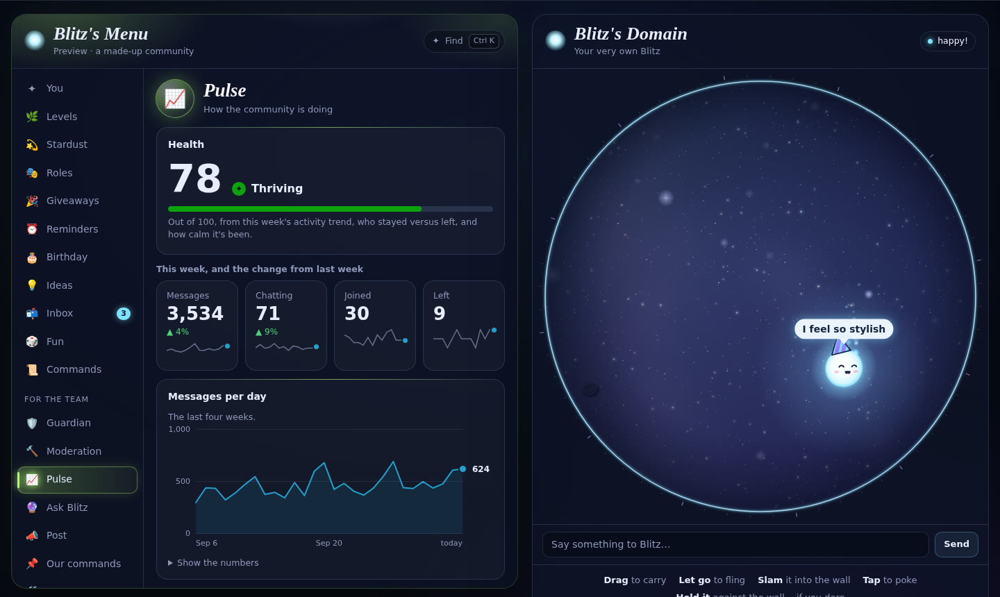
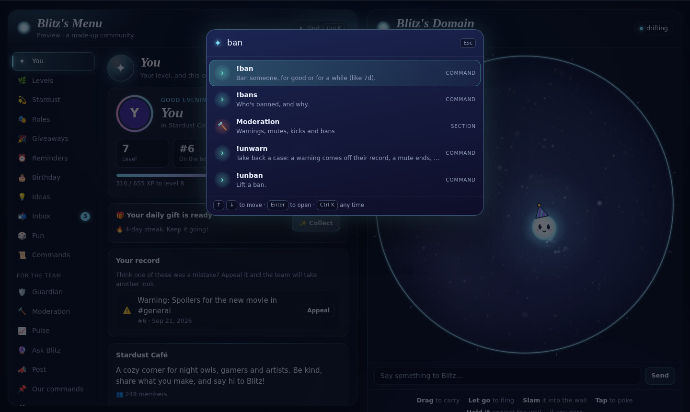

# Reviewing Blitz

A short guide for anyone reviewing Blitz: what it is, how to see it working in two minutes, how it's put together, what it asks Root for and why, what it keeps, and what it sends outside Root. The [README](../README.md) has the full feature list, and [PRIVACY.md](../PRIVACY.md) is the user-facing version of the data section.


## What it is

Blitz is a community App for Root: a server side that moderates and runs community features in chat (scam and raid shields, auto-mod, numbered moderation cases with a warning ladder, a private inbox with the team, levels, Stardust, giveaways, polls, reminders and more), and a client, its **domain**, where every viewer gets their own Blitz to play with, plus a menu that does everything chat commands do. Claude is optional: with a community's own Anthropic API key, Blitz answers chat in character and helps the team (report summaries, context checks, catch-ups, questions about the community), and it never acts on its own.

## See it in two minutes

No Root account needed:

```bash
cd blitz
npm install
npm run build      # generates the client/server calls and builds everything
npm run demo       # opens the domain in a browser, with a made-up community ("Stardust Café") in the menu
```

Everything in the menu works against the made-up data: try the shop, raise the raid shield in Guardian, open an appeal, ask Ask Blitz a question, press Ctrl K. Burst the bubble (hold Blitz against the wall) and press **✦ Summon menu** for the dream menu.

In a real test community, with an App ID and a DEV_TOKEN from the Root Developer Portal, the [setup guide](SETUP-GUIDE.md#try-it-in-your-test-community) takes about five minutes (`npm run configure`, `npm run server`, `npm run client`).

| | |
| --- | --- |
|  |  |
|  |  |

## Checks

```bash
cd blitz
npm run check      # builds all four packages (strict TypeScript) and runs the unit tests
```

The tests cover the pure logic: scam-link detection and lookalike folding, raid detection and the warning ladder, auto-mod rules, parsing (durations, dice, polls, dates), levels and Stardust maths, giveaways, Pulse's summaries and health score, the shared physics and rocks, the rich-text renderer, checking Claude's replies before Blitz acts on them, and the store's lock and short-lived cache. Everything that talks to Root goes through a small number of wrappers (below), which keeps the tested logic free of the SDK.

## How it's put together

```
blitz/
├── root-manifest.json   permissions and the settings page
├── networking/          menu.proto and domain.proto: the client ↔ server calls
├── shared/              used by both sides: physics, moods and tricks, rocks, cosmetics, rich text, the brain's reply format
├── server/              Node, @rootsdk/server-app
│   ├── core/            every Root call (rate limited, retried), the key-value store, settings, members and access, per-key locks, jobs
│   ├── logic/           pure, unit-tested rules (no SDK)
│   ├── features/        one file per feature: guardian, moderation, inbox, automod, levels, stardust, giveaways, pulse, …
│   └── domain/          the domain and menu services, and Blitz's brain (chat, report triage, Ask Blitz)
└── client/              the domain: one canvas (Blitz, the bubble, open space) and the menu (plain DOM, no framework)
```

A few design choices worth knowing:

- **Every Root call goes through `core/api.ts`.** Writes share a token bucket (5 a second, Root's limit for state changes) and queue rather than fail; transient errors are retried with backoff and jitter. Nicknames are cached and looked up at most six at a time.
- **The menu runs Blitz's own commands** (`core/commands.ts` `runFromMenu`), so a button can never do more than the same person could type, with the same permission checks. Staff can't act on anyone ranked at or above them.
- **The menu always answers.** Its overview loads every part at once, each with its own time limit, and leaves out (and logs) a part that fails rather than failing the whole menu. The window retries on its own if Blitz's server can't be reached.
- **One feature failing can't stop the rest.** Each feature starts on its own; the domain and menu services are registered first; a last-resort handler logs any unhandled rejection instead of letting Node stop the process.
- **The domain is the viewer's own.** Physics runs in fixed steps on the client (drawn between steps, so motion is smooth at any refresh rate), and nothing anyone does in the domain is sent anywhere. Only what someone types to Blitz there goes to the server, to be answered.
- **Built for computers without a graphics card.** Root's desktop app often draws in software, so the domain is a single canvas with cached layers and adaptive quality, and the menu's effects animate only transforms and opacity, briefly. A frame of the idle bubble takes about 3 ms in a software-rendered browser.

## Permissions

| Permission | Why |
| --- | --- |
| View channels, read message history | Commands, XP, the shields and auto-mod, the quote wall, and (with the brain) reading the conversation it's answering |
| Send messages, mention, react | Replies, welcomes, level-ups, announcements, the quote wall, polls and giveaways |
| Delete others' messages | Auto-mod and the scam shield, holding back a muted member's messages (Blitz's mutes need no role), lockdowns, and `!clear` |
| Manage roles | Only to hand out the roles a community picks: a role for newcomers, self-roles, level rewards, a birthday role |
| Kick, create and manage bans | Only when the team uses `!kick`, `!ban` or `!unban` (or the warning ladder steps a community turns on) |

Blitz never creates or edits channels or roles, and needs nothing beyond these.

## What it keeps

Everything is in the App's own key-value store for that community; nothing is shared between communities. Per member: XP and message counts, a birthday (month and day, never the year), Stardust and looks, reminders, their inbox conversations, and their moderation cases. Per community: polls, suggestions, community commands, giveaways, level rewards, recent shield catches, lockdowns and slowmodes, and daily activity counts for Pulse (numbers only, kept 60 days). The message log, if a community turns it on, keeps recent messages in memory only, at most two days, never on disk and never from channels marked private. [PRIVACY.md](../PRIVACY.md) lists it all in plain words.

## What leaves Root

Only one thing, and only if a community's admins paste an Anthropic API key into Blitz's settings: requests to Anthropic's API.

- **Chat:** the message to Blitz and up to 12 messages before it in that channel (with display names), plus the community's name, channels, commands and the admins' "about" text.
- **With "Let Blitz's brain help moderate" ticked:** a reported message with up to 25 around it, a blocked-word hit with the 6 before it, a channel's recent messages for `!tldr`, and what Ask Blitz looks up for a team member's question (read-only tools over Blitz's records and recent chat; it can't change anything).
- Never anything from channels a community marks private. At most 200 requests an hour per community, after which Blitz answers with its wits (below). The key is read from the App settings and never logged or stored by Blitz.

Without a key, Blitz sends nothing anywhere: it answers with its wits (`shared/src/wits.ts`), plain pattern matching over what it already knows (the community's channels and their topics, its own commands, the asker's level and Stardust). When someone asks for something in their own words ("remind me in 2h to stretch", "give me the gamer role"), it runs the real command as them, through the same permission checks as typing it.

## Known limits

Root doesn't give Apps account ages, so there's no account-age gate (the newcomer link wait and the raid shield cover the common raid pattern). There's no anti-nuke or backup of channels and roles, no social-media feeds, and no voice features. [WHY-BLITZ.md](WHY-BLITZ.md) compares Blitz with the Discord bots it learned from.
